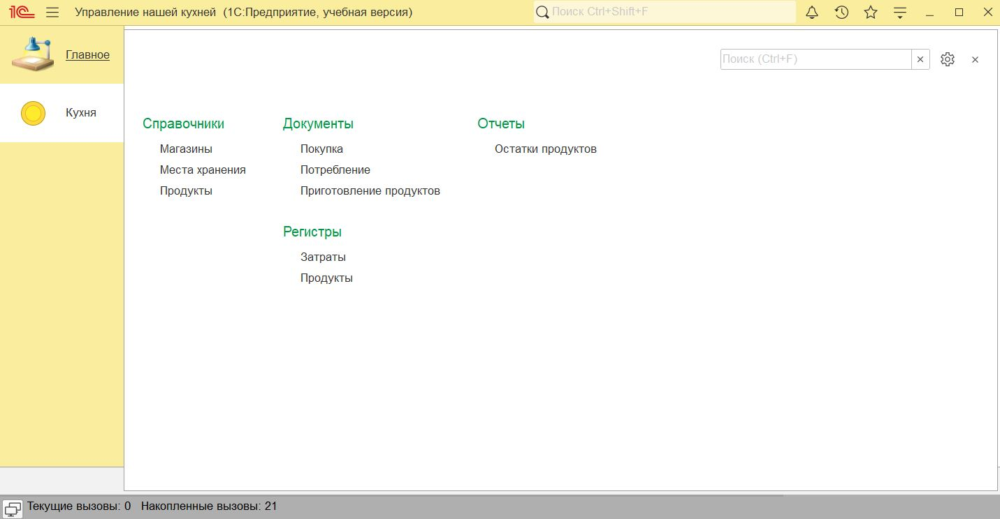
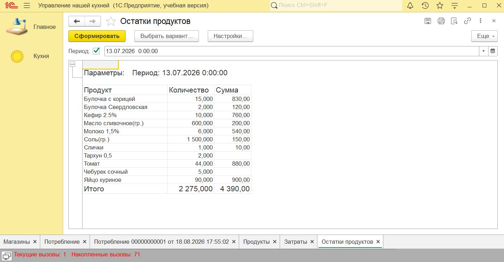
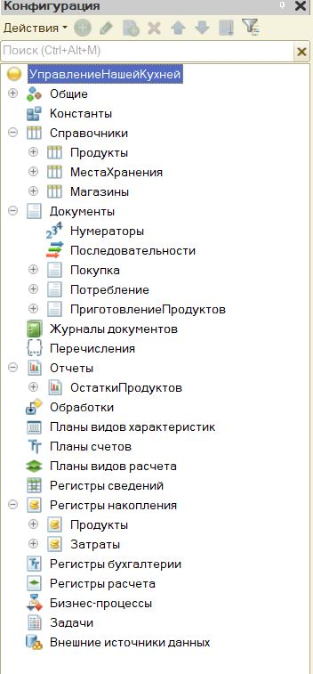
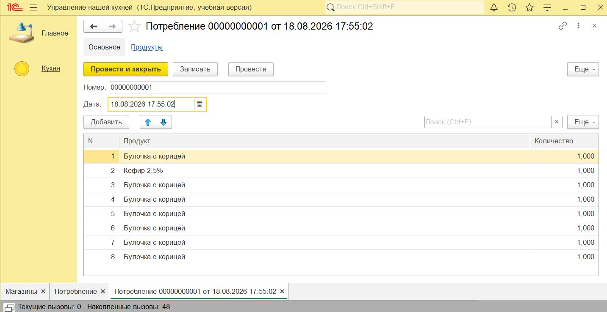

# 🍽️ Управление нашей кухней

> Учебная конфигурация на платформе **1С:Предприятие 8.3** для автоматизации домашнего учёта продуктов: от покупки в магазине до приготовления блюда.

---

## 📌 О проекте

**«Управление нашей кухней»** — первая учебная конфигурация, разработанная с нуля на платформе 1С:Предприятие 8.3. Реализует базовый цикл учёта продуктов: покупка, хранение, приготовление блюда по рецепту и потребление.

В проекте применены справочники с табличными частями, документы с проведением, регистры накопления, управляемые формы, запросы к виртуальным таблицам и отчёт на СКД.

---

<p align="center">
  
</p>

<p align="center">
  <em>Главное окно конфигурации и доступные объекты системы</em>
</p>

---

## 🛠️ Технические характеристики

| Параметр | Значение |
|---|---|
| Платформа | 1С:Предприятие 8.3 |
| Совместимость | 8.3.18 и выше |
| Режим работы | Управляемое приложение (интерфейс Такси) |
| Язык разработки | Встроенный язык 1С (русский синтаксис) |
| Режим блокировок | Управляемый |

---

## 🏗️ Структура конфигурации

```
Кухня
├── 🗂️  Справочники (3)
├── 📄  Документы   (3)
├── 📊  Регистры    (2)
└── 📈  Отчёты      (1)
```

---

### 🗂️ Справочники

#### `Продукты` — центральный объект
| Реквизит / ТЧ | Тип | Описание |
|---|---|---|
| `МожноПриготовить` | Булево | Признак: продукт является блюдом |
| ТЧ `Ингредиенты` → `Продукт` | СправочникСсылка.Продукты | Ингредиент блюда |
| ТЧ `Ингредиенты` → `Количество` | Число | Необходимое количество |

Формы: **ФормаЭлемента · ФормаСписка · ФормаВыбора**

#### `МестаХранения`
Справочник мест хранения продуктов (холодильник, кладовая и т.д.)

#### `Магазины`
Справочник магазинов, используется в документе «Покупка».

---

### 📄 Документы

#### `Покупка`
Фиксирует поступление продуктов из магазина.

| Реквизит | Тип | Описание |
|---|---|---|
| `Магазин` | СправочникСсылка.Магазины | Место покупки |
| `СуммаДокумента` | Число | Итоговая сумма |
| ТЧ `Продукты` → `Продукт` | СправочникСсылка.Продукты | Наименование |
| ТЧ `Продукты` → `Количество` | Число | Купленное количество |
| ТЧ `Продукты` → `Цена` | Число | Цена за единицу |

#### `Потребление`
Фиксирует прямой расход продуктов.

| Реквизит | Тип | Описание |
|---|---|---|
| ТЧ `Продукты` → `Продукт` | СправочникСсылка.Продукты | Наименование |
| ТЧ `Продукты` → `Количество` | Число | Потреблённое количество |

#### `ПриготовлениеПродуктов`
Документ приготовления блюда. Автоматически рассчитывает и списывает ингредиенты по рецепту с учётом количества порций.

| Реквизит | Тип | Описание |
|---|---|---|
| `Продукт` | СправочникСсылка.Продукты | Приготавливаемое блюдо |
| `КоличествоПорций` | Число | Количество порций |
| ТЧ `Продукты` → `Продукт` | СправочникСсылка.Продукты | Ингредиент |
| ТЧ `Продукты` → `Количество` | Число | Количество ингредиента |

> Имеет **модуль объекта**, **модуль менеджера** и **форму документа**.

---

### 📊 Регистры накопления

#### `Продукты` — учёт остатков
| Объект | Тип | Описание |
|---|---|---|
| Измерение `Продукт` | СправочникСсылка.Продукты | Разрез учёта |
| Ресурс `Количество` | Число | Остаток в натуральном выражении |
| Ресурс `Сумма` | Число | Остаток в денежном выражении |

#### `Затраты` — учёт расходов
| Объект | Тип | Описание |
|---|---|---|
| Измерение `Магазин` | СправочникСсылка.Магазины | Разрез по магазинам |
| Ресурс `Сумма` | Число | Сумма затрат |

---

### 📈 Отчёты

#### `ОстаткиПродуктов`
Построен на **СКД**. Показывает актуальные остатки с настраиваемой группировкой, отборами и сортировкой.

---

## 🔄 Логика работы

```
🛒 Покупка
    │
    ├──► Регистр «Продукты»  (+количество, +сумма)
    └──► Регистр «Затраты»   (+сумма по магазину)
              │
              ▼
    🍳 ПриготовлениеПродуктов
              │
              ▼  (списание ингредиентов по рецепту × кол-во порций)
    Регистр «Продукты» (- ингредиенты)
    Регистр «Продукты» (+ готовое блюдо)
              │
              ▼
    🥗 Потребление
              │
              ▼
    Регистр «Продукты» (-количество)
              │
              ▼
    📊 Отчёт «ОстаткиПродуктов»
```

---

## 📸 Скриншоты

### Отчёт по остаткам продуктов

Отчёт построен на СКД и показывает количество и стоимость продуктов на выбранную дату.

<p align="center">
  
</p>

### Структура объектов конфигурации

В конфигурации используются справочники, документы, регистры накопления и отчёт на СКД.

<p align="center">
  
</p>

### Проведение документа

Документы формируют движения по регистрам накопления: поступление, списание продуктов и учёт затрат.

<p align="center">
  
</p>

---

## 🚀 Чему научился в ходе разработки

- Проектирование структуры конфигурации с нуля
- Создание справочников с табличными частями и формами
- Написание модулей объектов (проведение документов)
- Настройка регистров накопления для учёта остатков и затрат
- Построение отчётов на СКД

---

## 📁 Состав репозитория

```
├── УНК.cf                    # Файл конфигурации 1С
├── УНК.dt                    # Дамп базы данных с тестовыми данными
├── УНКConfiguration.xml      # Описание объектов метаданных
├── УНКConfigDumpInfo.xml     # Служебная информация о выгрузке
└── README.md                 # Описание проекта
```

---

## 📋 Требования и установка

**Требуется:** 1С:Предприятие 8.3.18 или выше

**Установка конфигурации:**
1. Создать новую ИБ в конфигураторе
2. `Конфигурация → Загрузить конфигурацию из файла` → `УНК.cf`
3. Обновить конфигурацию БД (`F7`)

**Загрузка с тестовыми данными:**
1. `Администрирование → Загрузить информационную базу` → `УНК.dt`

---

*Первый учебный проект. Следующий проект — [1С:Купец](https://github.com/golden-platypus/1c-kupets) — значительно сложнее и охватывает торговый, кадровый и бухгалтерский учёт.*
